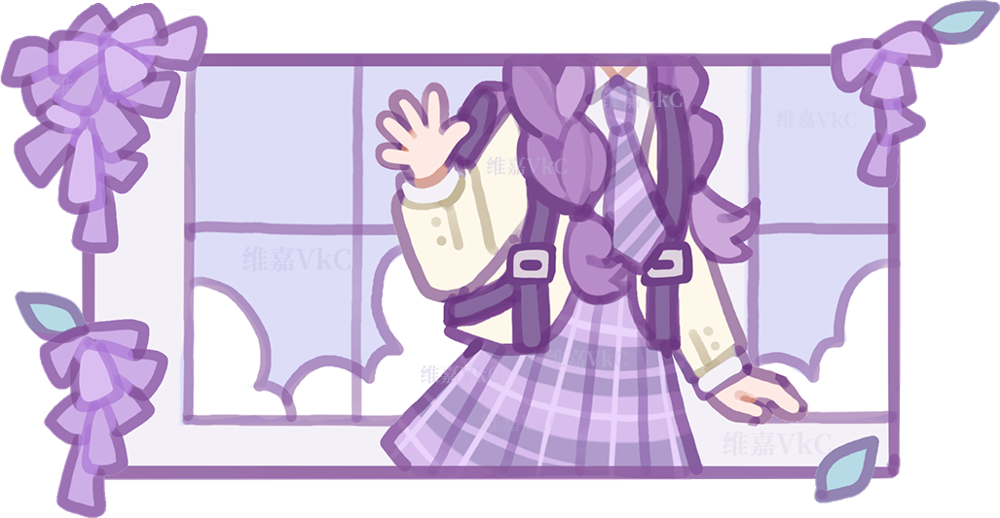

<div align="center">

</div>

## About Me

<div align="center">
  
</div>

```yaml
name: 维嘉VkC
roles: Creative Developer · Visual Design Learner · Digital Content Creator

interests:
  - Visual design and digital media
  - Software customization and creative coding

currently_exploring:
  - UI and theme customization
  - Video content creation
  - Web and software tools
  - Programming basics
  - Digital asset organization
```


## Software & Programming Languages

### Software

<p>
  
  
  
</p>

### Programming Languages

<p>
  
  
  
  
</p>

## Contact

<p>
  <a href="mailto:vikakumachr@gmail.com">
    
  </a>
  <a href="https://github.com/VikaKumaChR">
    
  </a>
</p>

## Creative Life

<p>
  <a href="https://space.bilibili.com/387756916">
    
  </a>
</p>

## Activity

<div align="center">
  <a href="https://github.com/VikaKumaChR">
    
  </a>
</div>

<div align="center">

</div>
